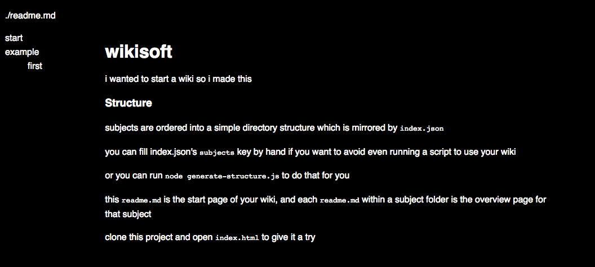

# monotome
i wanted to start a wiki so i made this

### Get Started
* **Clone** this project
* **Open** a terminal
* **Navigate** to the cloned directory
* **Run** `python -m http.server 8900`
* **Browse** to `localhost:8900` to use the wiki

---

### Structure
**Subjects** are ordered into a simple directory structure which is mirrored by `index.json`.

You can fill `index.json`'s `subjects` by hand if you want to avoid running a script. You can also run `node monotome/bin/generate.js`, which will update `index.json` for you.

This `readme.md` is the start page of your wiki and each `readme.md` within a subject folder is the overview page for that subject.

### Inlined articles
Monotome supports a link syntax for inlining other monotome articles (i.e. plain markdown files) into a source article. This technique is commonly known as [transclusion](https://en.wikipedia.org/wiki/Transclusion).

Any link `<a>` with an href referring to a local file & which has the anchor tag attribute `download` will be inlined into the document. That is, if one file has some content followed by ``, then the contents of `example/first.md` is inlined in place of the anchor tag, at the position of the tag definition.

### Backlinks
Monotome keeps track of backlinks, or incoming links from one article inside monotome to another. To discover backlinks, run `node monotome/bin/generate.js`. For a taste of what backlinks look like in practice, see the gif below.

### Wiki syntax (searchlinks)

Monotome has support for the common `[[wiki]]` syntax, although it implements it in a slightly
different way. When you use wiki syntax on a word or phrase in your wiki, a link will be created.
Clicking that link will perform a search on the subjects and articles of a wiki and navigate to
the first result of that search. 

If the result was not what you wanted, you can page the searchlink results with the left and
right arrow keys.

Just as `[article](subject/file.md)` links are tracked with backlinks, so too are `[[wiki]]`
links.

### License
monotome's code and resources are licensed under AGPL. 

`marked.js` is MIT-licensed and Inter UI is available under `SIL OPEN FONT LICENSE Version 1.1`

Read the respective license files for more information.
